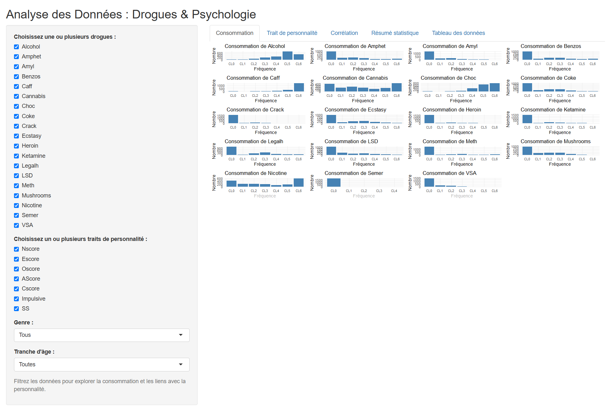
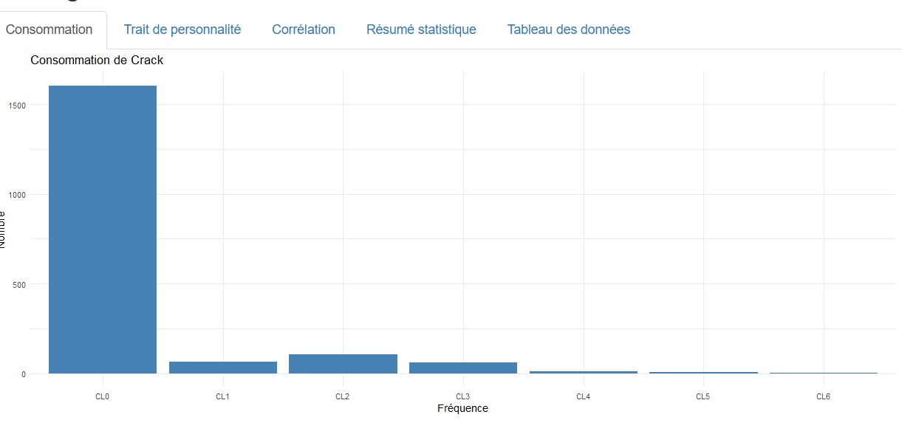
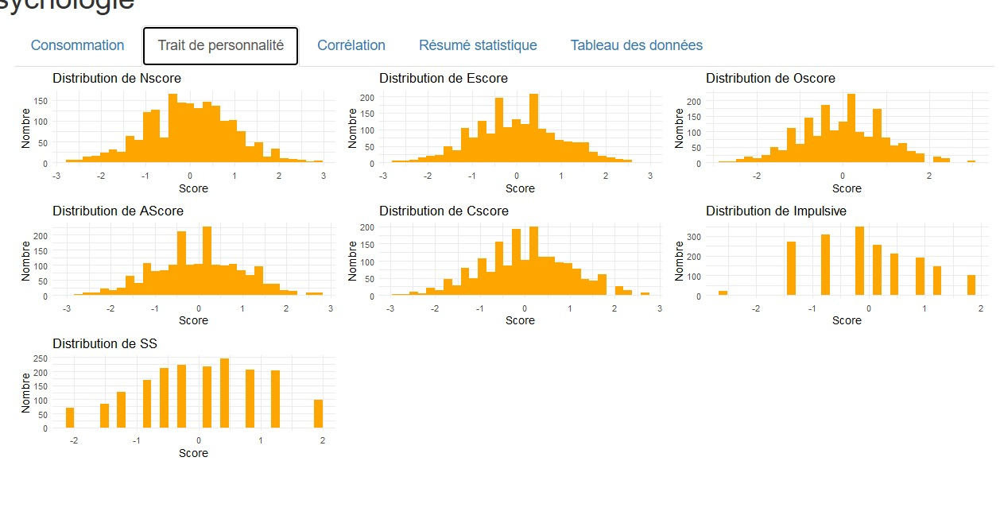
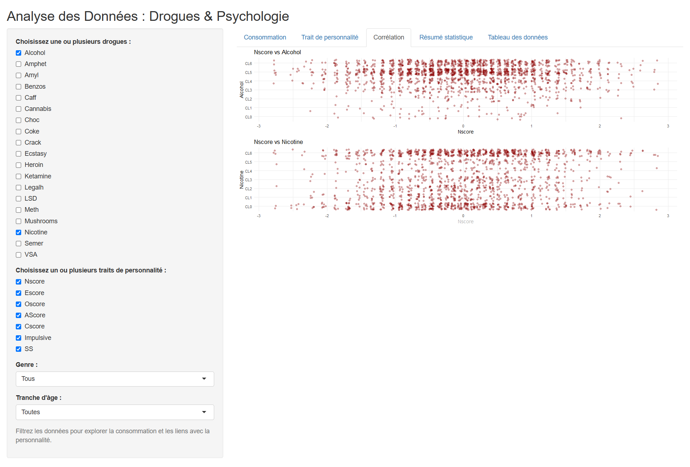
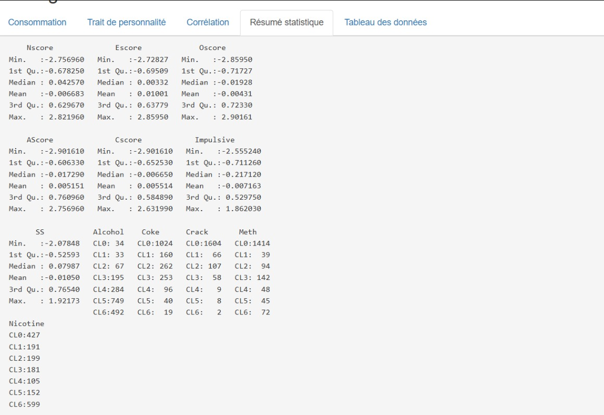
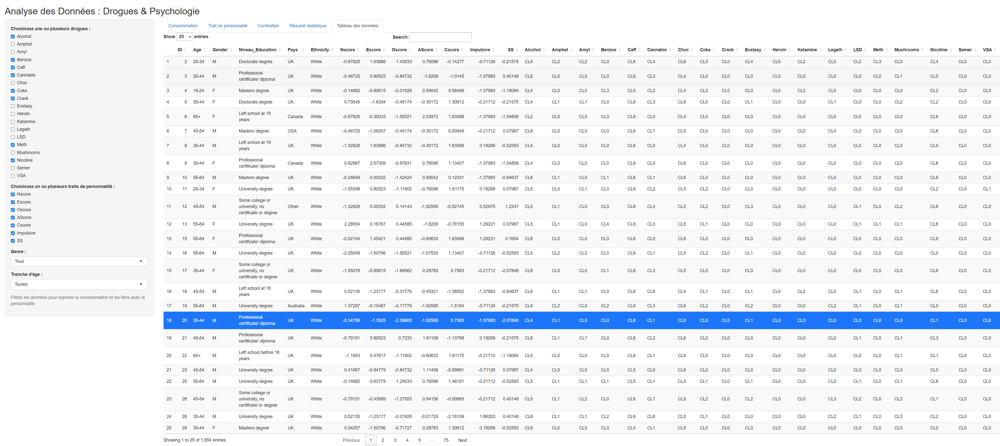

class: inverse, center, middle

# Dashboard Interactif
## Analyse Drogues & Psychologie

### Explorer la relation entre les traits de personnalité et les schémas de consommation de substances

Conçu avec **R Shiny**, **ggplot2**, **DT**, et **dplyr**

---

# Vue d'ensemble du projet

.pull-left[
**Objectif** : Créer un outil interactif permettant d'explorer les relations entre :
- Les traits de personnalité psychologique
- Les comportements de consommation
- Les facteurs démographiques

**Utilisateurs cibles** :
- Chercheurs en psychologie et santé publique
- Professionnels de santé
- Décideurs et acteurs de prévention
- Étudiants en sciences humaines
]

.pull-right[
**Fonctionnalités clés** :
- Filtres et visualisations dynamiques
- Exploration multidimensionnelle
- Résumés statistiques et corrélations
- Export des données pour analyses externes
- Interface accessible à tous les publics

**Impact recherché** :
- Démocratiser l'accès aux données psychologiques
- Faciliter la prise de décision basée sur l'évidence
- Soutenir la prévention personnalisée
]

---

# Fondations des données

.pull-left[
**Source** : UCI Drug Consumption Dataset
- **Taille** : 1 854 individus
- **Variables** : 32 colonnes
- **Données** : personnalité et consommation détaillées

**Qualité des données** :
- Filtrage Z-score appliqué (|z| > 3 retirés)
- Scores standardisés
- Catégories de consommation validées
]

.pull-right[
**Catégories de variables** :

🧠 **Traits de personnalité** (7 indicateurs)
- Big Five, impulsivité et recherche de sensations

💊 **Substances** (18 types)
- Légales : alcool, nicotine, caféine
- Illégales : cannabis, cocaïne, héroïne, etc.

👤 **Démographie**
- Âge, genre, éducation
- Pays et ethnie
]

---

# Définition des traits de personnalité

<style>
.small-table table {
  font-size: 14px;
}
</style>

.small-table[
| Trait | Nom complet | Signification psychologique |
|-------|-------------|------------------------------|
| **Nscore** | Névrosisme | Instabilité émotionnelle, anxiété, réactivité au stress |
| **Escore** | Extraversion | Engagement social, énergie, émotions positives |
| **Oscore** | Ouverture | Curiosité, créativité, ouverture aux expériences |
| **AScore** | Agréabilité | Coopération, empathie, altruisme |
| **Cscore** | Conscience | Organisation, discipline, contrôle de soi |
| **Impulsive** | Impulsivité | Réactions spontanées, difficulté à différer |
| **SS** | Recherche de sensations | Besoin de nouveauté et de stimulation intense |
]

**Intérêt clinique** : Ces traits sont des prédicteurs avérés des comportements à risque et des résultats thérapeutiques en addictologie.

---

# Interprétation de l'échelle de consommation

Le dataset utilise une échelle ordinale à 7 points (CL0-CL6) représentant la **récence d'usage** :

.pull-left[
| Code | Dernière consommation |
|------|------------------------|
| **CL0** | Jamais utilisé |
| **CL1** | Il y a plus de 10 ans |
| **CL2** | Il y a plusieurs années |
| **CL3** | Il y a quelques mois |
]

.pull-right[
| Code | Dernière consommation |
|------|------------------------|
| **CL4** | Il y a quelques semaines |
| **CL5** | Il y a quelques jours |
| **CL6** | Aujourd'hui ou presque |
]

**Utilité analytique** : Cette échelle capture à la fois les patterns d'expérimentation (CL1-CL3) et les comportements d'usage actif (CL4-CL6), permettant une analyse nuancée des trajectoires de consommation.

---

# Architecture du Dashboard

```{r, echo=FALSE, fig.align='center', out.width='85%'}

```

**Design interactif** :
- **Panneau gauche** : Contrôles de filtrage dynamique (substances, traits, démographie)
- **Panneau droit** : Cinq perspectives analytiques avec mise à jour temps réel
- **Layout réactif** : S'adapte aux sélections utilisateurs pour une analyse ciblée

---

# Navigation dans le Dashboard

Le dashboard propose **5 onglets d'analyse complémentaires** :

.pull-left[
**1. Consumption**
- Distribution par substance
- Visualisation fréquence et récence
- Patterns d'usage populationnel

**2. Trait de personnalité**
- Distribution des scores dans l'échantillon
- Profils psychologiques de la population
- Interprétation des scores standardisés
]

.pull-right[
**3. Correlation**
- Cartographie des relations traits-substances
- Visualisations en nuages de points
- Outils d'identification de patterns

**4. Statistical summary**
- Statistiques descriptives par sélection
- Capacités d'analyse comparative

**5. Raw data table**
- Exploration du dataset filtré
- Fonctionnalités d'export pour la recherche
]

---

# Onglet Consumption : Cas de l'alcool

```{r, echo=FALSE, fig.align='center', out.width='75%'}
knitr::include_graphics("screenshot_alcool.jpg")
```

**Observations clés** :
- Forte concentration en **CL5-CL6** (usage récent/actuel)
- Reflet du statut légal et de l'acceptabilité sociale de l'alcool
- Pattern typique des substances légales dans les sociétés occidentales

---

# Analyse approfondie : Consommation d'alcool

**Implications psychologiques** :
- La normalisation sociale masque les risques de dépendance
- Les profils **haute extraversion + faible conscience** montrent plus d'usage régulier
- Corrélation positive avec la **recherche de sensations** dans les contextes sociaux

**Applications santé publique** :
- **Baseline de référence** pour comparer aux substances contrôlées
- Identification des **seuils problématiques** (passage de CL3 à CL5+)
- **Prévention ciblée** : focus sur les jeunes adultes extravertis

**Hypothèse de recherche** : L'alcool sert de "substance passerelle" vers d'autres comportements à risque chez les profils impulsifs.

---

# Onglet Consumption : Cas du crack

```{r, echo=FALSE, fig.align='center', out.width='75%'}

```

**Observations clés** :
- Majorité écrasante en **CL0** (jamais utilisé)
- Très faible consommation active (CL4-CL6)
- Pattern de forte aversion naturelle au risque

---

# Analyse approfondie : Consommation de crack

**Corrélations personnalité** :
- Les rares utilisateurs montrent des scores **très élevés** en impulsivité et recherche de sensations
- Profils souvent associés à un **névrosisme élevé** (automédication)
- **Faible conscienciosité** = facteur de risque majeur

**Impact des politiques publiques** :
- **Réduction des risques efficace** : les campagnes de sensibilisation fonctionnent
- **Barrières à l'entrée** : stigmatisation sociale protectrice
- **Population à risque identifiable** : profils psychologiques spécifiques

**Insight stratégique** : Concentrer les ressources sur les **profils extrêmes** (impulsivité + sensation seeking élevées) plutôt que sur la population générale.

---

# Onglet Trait de personnalité : Distributions

```{r, echo=FALSE, fig.align='center', out.width='75%'}

```

**Qualité statistique** :
- Scores centrés sur 0 → normalisation confirmée
- Distributions quasi-normales → validité des échelles psychométriques
- Variabilité suffisante pour les analyses corrélationnelles

---

# Analyse des profils psychologiques

**Patterns observés dans les distributions** :
- **Névrosisme** : distribution légèrement décalée vers les valeurs positives → échantillon plus anxieux que la moyenne
- **Extraversion** : répartition équilibrée → représentativité populationnelle
- **Impulsivité** : queue de distribution importante → sous-groupe à haut risque identifiable

**Applications cliniques** :
- **Dépistage précoce** : scores > +2 SD nécessitent une attention particulière
- **Prédiction comportementale** : combinaisons de traits permettent de prévoir les risques
- **Personnalisation thérapeutique** : adapter les interventions selon les profils

**Découverte majeure** : Les **interactions entre traits** (ex: névrosisme × impulsivité) sont plus prédictives que les scores individuels.

---

# Onglet Correlation : Vue d'ensemble

```{r, echo=FALSE, fig.align='center', out.width='80%'}

```

**Approche analytique** :
- Nuages de points multiples entre traits et substances
- Identification visuelle des **clusters à risque**
- Détection des **profils atypiques** (outliers)

---

# Insights des corrélations multiples

**Patterns émergents identifiés** :
- **Impulsivité élevée** + consommation récente = cluster de risque majeur
- **Recherche de sensations** corrèle positivement avec **polyconsommation**
- **Conscienciosité élevée** = facteur protecteur universel

**Applications pratiques** :
- **Scoring de risque** : algorithmes basés sur les combinations de traits
- **Intervention précoce** : cibler les individus dans les zones à haut risque
- **Prédiction rechute** : profils psychologiques comme indicateurs pronostiques

**Innovation méthodologique** : Cette approche **multivariée simultanée** révèle des interactions invisibles dans les analyses bivariées traditionnelles.

---

# Onglet Statistical summary : Métriques

```{r, echo=FALSE, fig.align='center', out.width='80%'}

```

**Métriques disponibles** :
- Statistiques descriptives complètes (moyennes, médianes, quartiles)
- Comptages et pourcentages par classe de consommation
- Mise à jour dynamique selon les filtres actifs

---

# Utilité des résumés statistiques

**Applications recherche** :
- **Validation d'hypothèses** : vérification rapide des distributions attendues
- **Détection d'anomalies** : identification des biais dans les sous-échantillons
- **Comparaisons inter-groupes** : différences statistiquement significatives

**Valeur pédagogique** :
- **Apprentissage statistique** : visualisation immédiate de l'impact des filtres
- **Littératie des données** : compréhension intuitive des métriques descriptives
- **Formation pratique** : passage de l'exploration à l'interprétation formelle

**Innovation dashboard** : Les statistiques se **recalculent instantanément** selon les sélections, permettant une exploration guidée et une validation continue des observations visuelles.

---

# Onglet Raw data table : Exploration

```{r, echo=FALSE, fig.align='center', out.width='80%'}

```

**Fonctionnalités interactives** :
- Tri par colonnes pour identifier les patterns
- Recherche textuelle pour cas spécifiques
- Export pour analyses externes approfondies

---

# Workflow de recherche intégré

**Pipeline méthodologique** :
1. **Exploration visuelle** → identification des patterns intéressants
2. **Filtrage ciblé** → isolation des sous-populations
3. **Validation statistique** → confirmation quantitative des observations
4. **Export données** → analyses externes (R, Python, SPSS)

**Avantages compétitifs** :
- **Reproductibilité** : filtres documentent automatiquement les critères de sélection
- **Collaboration** : partage facile des sous-échantillons d'intérêt
- **Publication** : données filtrées prêtes pour analyses statistiques formelles

**Impact méthodologique** : Ce dashboard transforme l'**exploration exploratoire** en **démarche scientifique structurée** tout en conservant la flexibilité créative.

---

# Filtrage avancé : Femmes 25-34 ans

```{r, echo=FALSE, fig.align='center', out.width='75%'}
knitr::include_graphics("screenshot_filtre_actif.jpg")
```

**Segmentation démographique** :
- Analyse ciblée sur un groupe homogène
- Adaptation instantanée de toutes les visualisations
- Révélation de patterns spécifiques au segment

---

# Analyse segmentée : Insights spécifiques

**Découvertes sur les femmes 25-34 ans** :
- **Consommation d'alcool** : pattern plus social, moins solitaire
- **Substances illégales** : corrélation plus forte avec le stress professionnel
- **Traits protecteurs** : conscienciosité plus élevée en moyenne

**Applications stratégiques** :
- **Marketing social** : messages de prévention adaptés par démographie
- **Politique publique** : ressources allouées selon les besoins spécifiques
- **Recherche clinique** : stratification pour essais contrôlés

**Méthodologie innovante** : Le filtrage **interactif temps réel** permet de tester instantanément des hypothèses sur des sous-groupes, accélérant drastiquement le processus de découverte scientifique.

---

# Applications concrètes par secteur

.pull-left[
**Psychologie clinique** :
- Évaluation des risques : scores de personnalité → prédiction comportementale
- Suivi thérapeutique : monitoring évolution traits + consommation
- Outils diagnostiques : aide à la décision clinique

**Santé publique** :
- Veille épidémiologique : détection précoce des tendances
- Planification préventive : allocation ressources basée sur données
- Évaluation d'impact : mesure efficacité des campagnes
]

.pull-right[
**Recherche académique** :
- Génération d'hypothèses : exploration guidée par visualisations
- Analyses préliminaires : validation rapide avant études formelles
- Pédagogie interactive : enseignement statistiques appliquées

**Décision publique** :
- Politiques basées sur preuves : argumentation chiffrée
- Réduction des risques : stratégies ciblées par profil
- Optimisation budgétaire : ROI des interventions préventives
]

---

# Architecture technique et performance

**Stack technologique** :
- **R Shiny** : framework d'applications web interactives
- **ggplot2** : visualisations statistiques avancées  
- **DT** : tableaux interactifs avec fonctionnalités de tri/recherche
- **dplyr** : manipulation efficace de données

**Caractéristiques techniques** :
- **Programmation réactive** : mises à jour instantanées des visualisations
- **Design responsive** : adaptation automatique aux différents écrans
- **Architecture optimisée** : performance fluide avec 1 854 observations × 32 variables
- **Sécurité données** : hébergement sécurisé sur shinyapps.io

**Innovation technique** : Intégration harmonieuse de multiples packages R dans une interface utilisateur unifiée et intuitive.

---

# Roadmap et améliorations futures

.pull-left[
**Extensions statistiques** :
- Tests de significativité : corrélations, ANOVA, régression
- Modélisation prédictive : machine learning intégré
- Analyses longitudinales : suivi temporel des patterns

**Connectivité avancée** :
- APIs de données : intégration bases externes
- Exports automatisés : rapports PDF programmés
- Synchronisation cloud : sauvegarde analyses utilisateur
]

.pull-right[
**Expérience utilisateur** :
- Version mobile native : application iOS/Android
- Tutoriels intégrés : parcours d'apprentissage guidé
- Collaboration : partage d'analyses entre utilisateurs

**Intelligence artificielle** :
- Détection automatique : alertes sur patterns anormaux
- Recommandations : suggestions d'analyses pertinentes
- NLP intégré : requêtes en langage naturel
]

---

# Impact et validation du projet

**Excellence technique démontrée** :
- **Architecture professionnelle** : standards industriels respectés
- **Performance optimisée** : réactivité fluide sur dataset complexe
- **Design UX** : interface intuitive pour utilisateurs non-techniques

**Contribution scientifique** :
- **Démocratisation** : accès simplifié aux analyses psychométriques complexes
- **Méthodologie** : template reproductible pour projets similaires
- **Pédagogie** : outil d'enseignement des statistiques appliquées

**Retombées sociétales** :
- **Santé publique** : meilleur ciblage des interventions préventives
- **Formation** : nouvelle génération de data scientists sensibilisés
- **Recherche** : accélération découvertes par exploration interactive

---

class: inverse, center, middle

# Démonstration en direct

## Accédez au dashboard interactif :

### 🔗 [romainjazzar.shinyapps.io/Rstudio_drug_analysis_psychology_datasets](https://romainjazzar.shinyapps.io/Rstudio_drug_analysis_psychology_datasets/)

**Testez les fonctionnalités** : filtres, corrélations, exports

---

class: center, middle

# Merci pour votre attention !

## Équipe de développement

**Romain Jazzar** • **Lisa Crebassa** • **Mohammed Zelmati**

*La Plateforme — Promotion 2025*

---

class: center, middle

### Questions & Discussion

**Cette réalisation illustre la puissance de R Shiny pour transformer des analyses psychologiques complexes en outils interactifs accessibles et actionnables.**

*L'avenir de la data science : rendre les insights exploitables par tous les acteurs de terrain.*